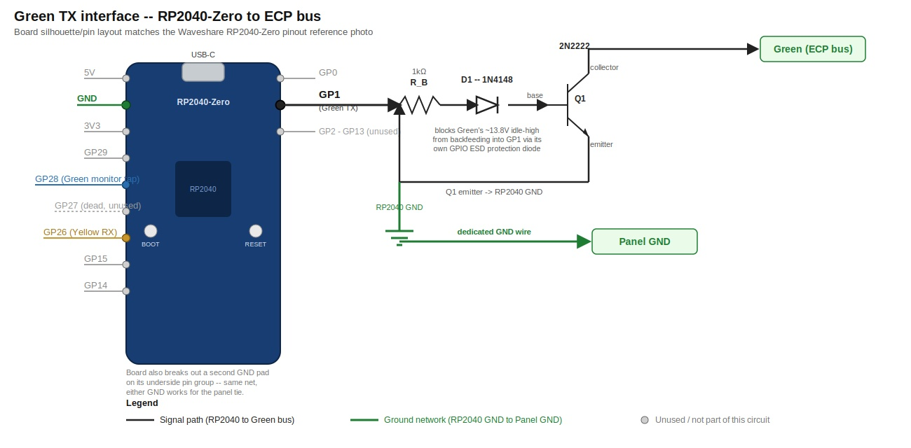

# Handheld/Field Unit Hardware Architecture & Bill of Materials

Goal: a robust, technician-borrowable tool that clips directly onto a Vista
panel's 4-wire keypad (ECP) bus — no Envisalink or other intermediary
module required — for zone/config discovery today, config writes next, and
eventually broader datalogging (Polling Loop, zone-terminal I/O) as the
project grows. See `CONCEPT.md` for the full product concept, UX flow, and
roadmap this hardware serves; this doc stays focused on the physical build.

## Why two processors, not one

The ECP bus is a real-time, interrupt-driven pulse protocol (`Dilbert66/esphome-vistaECP`
bit-bangs it on bare ESP8266/ESP32/RP2040 GPIO with microsecond-scale
timing). A Raspberry Pi running Linux cannot guarantee that kind of timing
under its own scheduler — a dropped or jittered pulse on a live panel bus is
exactly the failure mode the panel's own inactivity/watchdog behavior
punishes (see the protocol notes, section 7, on the panel backing out of
programming mode with no warning). So the design splits the work the same
way `esphome-vistaECP` already validates:

- **RP2040 coprocessor** — owns the ECP bus in real time: bit-level pulse
  timing, address-slot arbitration, keystroke injection, alpha-display
  capture, and keypad-address sniffing (scanning pulse-slot 3 — addresses
  16-23 per esphome-vistaECP's own pulse-allocation notes — for active
  keypads before the tool claims an address). Talks to the Pi over
  USB-serial (see "RP2040-Zero <-> Pi interconnect" below) using the plain
  text protocol in `firmware/SERIAL_PROTOCOL.md`. This is a near-direct
  port of esphome-vistaECP's `VistaECP` library running outside ESPHome
  (its own README notes the library has no ESPHome dependency and can be
  called directly).
- **Raspberry Pi** — everything that isn't time-critical: the `vista_tool`
  Python backend (walk logic, safety checks, timeouts), the FastAPI web
  server (serving the device's own AP-mode hotspot and, once joined to a
  network, any browser on it — see `CONCEPT.md` "Networking" section), and
  storage/logging. The device is fully headless — there's no local
  display, every client is a browser. If the Pi hiccups, worst case is a
  slow UI update — never a corrupted bus frame.

This also means the RP2040 firmware is a genuinely separate, testable unit:
it can be bench-validated against a real panel with nothing but a serial
terminal, before the Pi software or battery system are even wired in —
planned as the first real build/test milestone.

## Bill of materials (decisions marked; still-open items marked)

| Role | Part | Status |
|---|---|---|
| Compute | **Raspberry Pi 4, 8GB** (interim/dev board) | **Decided for now.** Pi Zero 2 W is the actual target board but is unobtainable during the ongoing 2026 shortage (Pi 3A+, Radxa Zero 3W, and Orange Pi Zero 2W/3 were evaluated as substitutes and rejected). User has several Pi 4s on hand, so it's the dev/bring-up board — build must stay Zero-2W-compatible throughout. See "Compute board: Pi 4 now, Zero 2 W target" below. |
| Bus coprocessor | **Waveshare RP2040-Zero** (ordered) | **Decided**, replacing the Pico. Same RP2040 silicon (firmware/SDK unaffected), but a different physical pinout — esphome-vistaECP's Pico-based pin assignments in the current schematic must be remapped pin-by-pin, which is also the opportunity to fix the existing GPIO_26 dual-assignment conflict (see "Still open" below) rather than patching it separately. See "Bus coprocessor: RP2040-Zero" below for LED/debug-connector differences. Still treated as the first of potentially several interface modules (see "Modularity" below). |
| Bus coprocessor link | **USB-serial** (single USB-C cable, RP2040-Zero to a Pi USB port) | **Decided (revisited).** A UART-over-GPIO-header plan was tried and reverted once remote firmware flashing came into scope — flashing needs a USB (or SWD) connection to the RP2040 regardless, so keeping the runtime data link on UART too would mean wiring both, not saving anything. See "RP2040-Zero <-> Pi interconnect" below. |
| Battery | **LiPo pouch pack, capacity undecided** | **Config decided, capacity open.** 1S2P (two cells in parallel, single nominal voltage — no balance leads needed, matches the original "single-cell" simplicity goal). Capacity pending enclosure dimensions (user is developing the case and will supply real size constraints). Sizing reference from the runtime discussion: ~6000mAh gets you right at a bare 2-hour floor on a *fresh* pack at an estimated 9-11W system draw (Pi 4 + Pico/RP2040 + conversion losses, measured without a display since the device is now headless) — that floor erodes below 2 hours as the pack ages (LiPo cells typically lose 20-30% capacity over their service life). Assistant's recommendation, not yet acted on: target a ~4hr fresh runtime (~11,000-13,000mAh) for real margin. Final call waits on case dimensions **and** on retesting the power draw on actual Zero 2 W hardware — Pi 4 draw figures are not valid for Zero 2 W sizing (see "Compute board" below). Not needed during the development/testing phase — the build will run on isolated wall power (via the isolated USB-C/DC-DC charge path below) until hardware is confirmed working. |
| Charge + power management | **USB-C charging circuit, with pass-through/overnight-charge support, on an ISOLATED DC-DC/charge path** | **Decided (revised).** The device runs off battery in the field and stays on USB-C power (charging while running) for unattended overnight logging sessions — not powered from the panel's own AUX terminals. Needs a charge IC/board that supports simultaneous charge+discharge (TP4056-style boards do NOT reliably support this — look at USB-C PD trigger + a proper charge/power-path IC, or a PowerBoost-style board that explicitly supports it) AND provides galvanic isolation between the external USB-C input and the internal battery/Pi/RP2040 rails (e.g. an isolated DC-DC converter module on the charge path). This is where the ground-loop protection now lives — see "Isolation strategy" below. |
| Bus interface (RP2040 <-> panel) | **Non-isolated** (resistor-divider + opto/transistor, per esphome-vistaECP's "simple version" schematic — their recommended default) | **Decided (revised from ground-isolated).** Shares ground directly with the panel, same as a real physical keypad's wiring (4-wire, no isolation, always has been how keypads connect). Chosen for full signal fidelity with zero compromise — esphome-vistaECP's own README calls this the best-signal, most-recommended option and calls the ground-isolated variant "least recommended" for signal quality. See "Isolation strategy" below for why this is safe given where isolation now lives instead. |
| Storage | **Industrial/endurance-rated microSD** | **Decided** — user has a good track record with these for continuous read/write workloads, covers the datalogging use case without needing an NVMe HAT. |
| Panel connection | 4-conductor cable + small screw terminal or keypad-style connector | Matches how a real alpha keypad taps the bus (red/black: +12V, GND; yellow: panel→keypad data; green: keypad→panel data — confirmed via the Vista-20P's own technician manual and reconciled bench data, see "Still open" item 1). |
| Networking | Pi's built-in WiFi only, AP-mode-first with STA fallback | **Decided (revised — wired Ethernet and the physical display both dropped; device is headless/WiFi-only).** See `CONCEPT.md` "Networking" for the AP/STA flow. No new hardware needed beyond the Pi's onboard radio; config must stay 2.4GHz-only for Zero 2 W compatibility (see "Compute board" below). |
| Enclosure | **User-designed, 3D-printed** | Out of scope for this doc — sized around the battery/board stack now that there's no display to accommodate. Kiosk/kickstand framing no longer applies since there's nothing to view locally; exact form factor still the user's call. |

## Compute board: Pi 4 now, Zero 2 W target

The Pi Zero 2 W was the original target board (small footprint, matches
the "handheld" framing) but is unobtainable during the ongoing 2026 supply
shortage. Alternatives evaluated and rejected for now: Pi 3A+, Radxa Zero
3W, Orange Pi Zero 2W/3. **Decided:** build on a Raspberry Pi 4 (user has
several on hand) as the interim/dev board, with the Zero 2 W remaining the
target once available. The Pi 4 build must stay Zero-2W-compatible, which
means baking in these constraints now rather than discovering them at
swap-over time:

- **`dtoverlay=dwc2,dr_mode=host`** in `config.txt`, added now — needed for
  the Zero 2 W's single OTG port to act as a USB host so it can talk to
  the RP2040-Zero at all; harmless (and unnecessary, since the Pi 4 has
  spare USB-A ports) on the Pi 4 dev board. This is now load-bearing, not
  just cheap insurance — see "RP2040-Zero <-> Pi interconnect" below.
- **2.4GHz-only WiFi/hostapd config, always** — the Zero 2 W has no 5GHz
  radio; the Pi 4 does. Don't let 5GHz creep into the AP/STA config during
  Pi 4 development.
- **Memory usage discipline** — the Zero 2 W has 512MB vs. the Pi 4's
  2-8GB. Avoid unbounded in-memory accumulation (scan history, logging
  buffers, worker counts); periodically test under an artificial memory
  limit rather than assuming Pi 4 headroom will always be there.
- **No dependency on `eth0` being present** in application code, even
  though the Pi 4's Ethernet port is sitting right there unused in dev —
  the Zero 2 W has none, and the product is WiFi-only now regardless (see
  `CONCEPT.md` "Networking").
- **Battery/power-draw measurements taken on the Pi 4 are not valid for
  Zero 2 W sizing** — the battery capacity decision (see "Still open"
  below) stays open until measured on actual Zero 2 W hardware.

## Bus coprocessor: RP2040-Zero

**Decided:** Waveshare RP2040-Zero (ordered), replacing the Pico. Same
RP2040 silicon, so the firmware/SDK is unaffected, but the physical pinout
differs from the Pico — esphome-vistaECP's Pico-based pin assignments
don't carry over unchanged. See "RP2040-Zero pin assignments (finalized)"
below for the actual remap, which also resolves the old GPIO_26
dual-assignment conflict as part of the same pass rather than patching it
separately on the old Pico pinout.

Two other physical differences worth planning around:

- **Status LED is WS2812 (addressable RGB)**, on a different GPIO than the
  Pico's simple LED. Since the device is now fully headless, this LED
  becomes a real UI surface — worth using for AP-mode/connected/error
  status signaling rather than just a heartbeat blink.
- **No keyed SWD debug connector** — the Pico H's keyed header is gone;
  the RP2040-Zero exposes SWD as bare test pads only. Hardware debugging
  (if ever needed beyond the serial/UART link) means hand-wiring probes to
  those pads.

### RP2040-Zero pin assignments (finalized)

Confirmed against the Waveshare RP2040-Zero's actual pinout diagram — the
ADC-capable pins (GP26-29) are broken out on this board, resolving the
"verify these exist before wiring" caution this doc previously carried.

| Signal | Pin | Notes |
|---|---|---|
| Yellow (panel TX → RP2040 RX, through the 39K/10K divider) | **GP26** (ADC0) | Digital input mode. **Confirmed via the Vista-20P technician manual** — see "Still open" item 1: this doc briefly had Yellow/Green swapped based on a bench observation that turned out to be a correlation error, corrected back once the manual settled it |
| Green (RP2040 TX → panel, drives the NPN base) | **GP1** | Digital output. Originally GP27 (ADC1) — moved after bench testing found GP27's GPIO driver dead on this chip: with GP27 fully isolated from the base circuit (1kΩ resistor lifted) and a firmware-forced, panel-independent announce burst (`Vista::debugForceKeyAnnounce()`) firing every second, an oscilloscope showed nothing but noise on GP27, while the identical burst came out clean and correctly bit-shaped on GP1 with no other change. GP1 was already free (see below). Base transistor: 2N2222, 1kΩ base resistor (see "Still open" item 1 for the sizing) |
| Green bus-monitor tap (separate divider, per esphome-vistaECP's `MONITORTX` feature) | **GP28** (ADC2) | Digital input — passively decodes *other* devices' traffic on Green (other keypads, zone expanders, RF receiver modules) that the RP2040 wouldn't otherwise see; not collision detection on the RP2040's own TX. Feeds the future "Wireless (RF) zone visibility" / datalogger-role work in `CONCEPT.md`, not required for near-term ECP read/write |
| Status LED (WS2812) | **GP16**, internal | Hardwired on-board, not a header pin — nothing to wire |

GP0 (originally earmarked for UART0 alongside GP1) is unused now that the
Pi interconnect is USB-serial again — see "RP2040-Zero <-> Pi interconnect"
below. GP1 itself was reassigned to Green TX per the row above.

### Green TX interface schematic (complete design)



(Source vector version: `docs/hardware/green-tx-schematic.svg`, same content.)

Board silhouette and pin positions (GND/GP1 on the top board, GP26/GP27/
GP28 further down the left column) match the Waveshare RP2040-Zero's own
pinout reference photo. The board also breaks GND out again on its
underside pin group (same net) — either GND pad works for the panel tie.

Two things this diagram makes explicit that the BOM/pin-table prose above
doesn't show visually:
- **The RP2040 GND ↔ panel GND wire is load-bearing, not optional.** Q1's
  emitter references RP2040 GND, not panel GND directly, so missing this
  wire doesn't just degrade the signal -- it means Green never carries a
  valid logic level from the panel's point of view at all, while Yellow
  RX keeps working anyway (enough margin on that side to tolerate a
  floating reference). See "Still open" item 1's ground-reference update
  below for the full story of how this was found.
- **D1 exists to block backfeed, not to pass signal.** Without it, the
  panel bus's idle-high voltage leaks back through Q1's collector-base
  junction, up R_B, and into GP1's GPIO protection diode -- confirmed by
  the RP2040's status LED lighting with USB unplugged, powered by
  leakage current alone. D1 is now installed and that specific symptom
  (and the real-keypad-17 bus lockup that came with it) is confirmed
  resolved; see "Still open" item 1's backfeed update below for what's
  still being chased (Green itself still isn't producing a signal at
  Q1's collector, under active bench investigation).

## RP2040-Zero <-> Pi interconnect: USB-serial (reverted from UART)

**Decided (revisited):** back to a single USB-C cable between the
RP2040-Zero and a Pi USB port, carrying both the runtime data link and
firmware flashing — reverting the earlier UART-over-GPIO-header decision.

The UART plan's stated benefit was freeing the RP2040-Zero's USB-C port
entirely for flashing/debugging. That benefit only holds if USB stays idle
except when someone physically plugs in a laptop. Once remote firmware
flashing *from the Pi itself* came into scope (see below), USB has to be
wired to the Pi permanently regardless of what the runtime link uses — so
UART stopped saving anything and just added a second connection (plus the
`disable-bt` overlay and `raspi-config` serial-console changes it
required) on top of a USB link that was needed anyway. Simpler to let one
USB-C cable do both jobs, same as the original pre-UART design:

- **Wiring:** one USB-C cable, RP2040-Zero to a Pi USB port. On the Pi 4
  dev board, any spare USB-A port. On the eventual Pi Zero 2 W target,
  its single OTG port, switched into host mode via
  `dtoverlay=dwc2,dr_mode=host` (see "Compute board" above) — that overlay
  is now load-bearing, not just insurance. No separate 5V/GND wiring is
  needed either; USB itself powers the RP2040-Zero, same as plugging it
  into any computer.
- **Firmware side:** `stdio_usb`/`Serial` (USB CDC) in the RP2040-Zero
  firmware — this undoes the earlier firmware-transport swap, back to
  what esphome-vistaECP's own reference builds use. GP0/GP1 (which would
  have carried UART0) go unused.
- **Remote flashing over the same cable:** the RP2040 ROM bootloader only
  speaks USB (or SWD) — never UART — so this was unavoidable once
  Pi-driven flashing was a goal. With the running firmware healthy, it can
  reboot itself into the USB mass-storage (UF2) bootloader on command —
  either via the Pico SDK's `reset_usb_boot()` triggered by a new command
  in `firmware/SERIAL_PROTOCOL.md`, or via the "1200-baud touch" auto-reset
  convention Arduino-Pico/`picotool` already implement for USB CDC boards,
  which may cover this for free without adding a custom command. The Pi
  then copies the new `.uf2` onto the resulting mass-storage device, or
  drives it with `picotool load`.
- **Crash-recovery fallback (still worth doing, independent of the
  UART/USB choice):** the software trigger above only works if the
  currently-running firmware is healthy enough to act on it. Wiring the
  RP2040-Zero's BOOTSEL and RUN/RESET pads to two spare Pi GPIOs lets the
  Pi force bootloader mode purely via GPIO control, regardless of firmware
  state — standard practice for headless/CI Pico setups. These pads
  aren't broken out to the header (same situation as the SWD test pads
  already noted above), so this means hand-soldering two wires, same
  effort as wiring up SWD debug access.
- **Worth a udev rule** on the Pi once this is built, so the RP2040's
  USB-serial device gets a stable path (e.g. `/dev/vista-rp2040`) instead
  of depending on `/dev/ttyACM0` enumeration order, which can shift across
  reboots or if other USB-serial devices are plugged in.

## Isolation strategy: isolate the power path, not the data path

Earlier revision of this doc put isolation on the ECP bus interface itself,
reasoning that the device's own independent power source (battery +
charger) could sit at a different ground potential than the panel. On
reflection that's solving the problem in the wrong place:

- **A real physical Vista keypad shares ground with the panel directly, with
  zero isolation, and that's fine** — the risk was never "touching the
  panel's ground," it's specifically having a *second*, independent
  connection to a *different* ground reference at the same time. A keypad
  never has that second connection; this device does, because of the
  USB-C charging path.
- Tying the device's ground to the panel's ground (non-isolated bus) is
  actually the fidelity-optimal choice — it's what esphome-vistaECP
  recommends by default, and it's how the real hardware already works.
- The actual ground-loop risk lives entirely in the charging path: if the
  device is charging from AC power that's referenced to a different earth
  ground than the panel's own AC-derived ground, bonding the device's
  ground to the panel's (via a non-isolated bus) could pull current through
  that charging connection. In practice this is a narrower risk than it
  sounds — most USB-C wall chargers are already internally isolated
  between mains and DC output (a standard safety-certification
  requirement), and a single building's outlets and its alarm panel are
  normally bonded to the same earth reference at the service panel anyway.
  But relying on "the charger a tech happens to grab is probably isolated"
  is a field-dependent assumption, not a guarantee.
- So: **isolate the power input instead.** An isolated DC-DC converter or
  isolated USB-C charge module between the external power connector and
  the internal battery/Pi/RP2040 rails closes the ground-loop risk
  regardless of what charging source gets used in the field (wall brick,
  laptop USB port, car adapter, whatever), while leaving the ECP bus
  interface fully non-isolated for full signal fidelity, always. Best of
  both, rather than a compromise between them.

## Modularity for future interface boards

The long-term roadmap (`CONCEPT.md`) adds Polling Loop bus monitoring (Vista
32/128/250 — a current-loop addressable-device protocol, electrically
distinct from ECP) and raw zone-terminal I/O (simple voltage/resistance
sensing, not a bus protocol at all). Neither is being built now — the
near-term goal is an ECP read/write utility — but the physical/electrical
design shouldn't paint itself into a corner: leave room (board space, a
spare USB port or header) for an additional interface module later rather
than assuming the ECP board is the only thing that will ever plug into the
Pi. Not a current blocker; revisit when those modules become real.

## Considered and set aside

Noted here rather than dropped from history, in case either becomes
relevant again later:

- **ESP32-as-host** (replacing the Pi entirely, RP2040↔ESP32 over SPI with
  the RP2040 as SPI master and the ESP32 as slave — ESP8266 slave mode was
  ruled out as unreliable). Electrically viable, but would mean porting the
  entire backend (FastAPI/Python walk logic, storage, WiFi management) to
  embedded C — a much bigger lift than the interconnect question alone.
  Not pursued for now.

## Wireless (RF) receiver visibility

Because the bus interface is a non-isolated tap on the same 4-wire keypad
bus a wireless receiver module (e.g. 5881ENL) broadcasts onto, this
hardware is electrically positioned to see raw RF receiver sentences the
same way AlarmDecoder (AD2) does — a superset of what an Envisalink
EVL3/EVL4 can ever expose over TPI, since the EVL4 only relays the panel's
own already-decided reporting. That RF-sentence decode is not implemented
by the current firmware plan (esphome-vistaECP's `VistaECP` class targets
keystroke injection and alpha-display capture) — it would need to be added
explicitly. See CONCEPT.md's "Wireless (RF) zone visibility" section for
the testing that established this and the open-thread tracking it.

## Data flow

```
Vista panel keypad bus (4-wire ECP)
        │  (non-isolated resistor-divider + opto/transistor interface,
        │   shares ground with panel — same as a real keypad)
        ▼
   RP2040-Zero  ── bit-bang ECP, emulate a virtual keypad address,
        │           scan pulse-slot 3 for in-use keypad addresses
        │  USB-serial, single cable to a Pi USB port — carries the
        │  runtime text protocol (firmware/SERIAL_PROTOCOL.md), powers
        │  the RP2040-Zero, and re-enumerates as a UF2 bootloader for
        │  remote firmware flashing from the Pi
        ▼
   Raspberry Pi 4, 8GB (interim — Pi Zero 2 W is the target board)
        │  vista_tool Python backend, safety rules,
        │  industrial microSD for logging
        │  WebSocket / HTTP, over WiFi only (2.4GHz)
        ▼
   AP mode (default, own hotspot) ──or── STA mode (joined to site WiFi;
   falls back to AP after a 5-minute connect timeout)
        │
        └──────────────► Any browser (tech's laptop or phone) — device is
                          headless, no local display; concurrent sessions OK

   USB-C external power (separate port, device's own charge input) ──
        [ISOLATED DC-DC / charge module] ── battery + Pi rail
        (ground-loop protection lives here, not on the bus interface —
         distinct from the RP2040-Zero's internal USB link above)
```

## Resolved items (previously open)

1. ~~Confirm the RP2040's virtual keypad address won't collide with existing
   keypads/modules~~ — resolved procedurally, not technically: this follows
   standard technician SOP (identify the in-use address, disconnect the
   field keypad, take its address), which the tool actively supports via
   the address-sniffing onboarding flow in `CONCEPT.md`. Address changes
   are live/hot on this bus with no special handling needed.
2. ~~Decide isolation vs. non-isolation~~ — resolved as non-isolated bus +
   isolated power path, not a fully isolated bus interface. See "Isolation
   strategy" section above for the reasoning.
3. ~~Display size~~ — 10.1in HDMI+USB-touch, kiosk/kickstand form factor, see
   BOM above. **Superseded** — see item 8 below: the display was dropped
   entirely and the device is now headless.
4. ~~Display model~~ — GeeekPi 10.1in 1280x800, see BOM above.
   **Superseded** — see item 8 below.
5. ~~Compute board~~ — Pi Zero 2 W remains the target but is unobtainable
   during the 2026 shortage; Raspberry Pi 4 decided as the interim/dev
   board (user has several on hand), built to stay Zero-2W-compatible. See
   "Compute board: Pi 4 now, Zero 2 W target" above.
6. ~~Bus coprocessor~~ — Waveshare RP2040-Zero decided (ordered),
   replacing the Pico. See "Bus coprocessor: RP2040-Zero" above.
7. ~~RP2040 <-> Pi interconnect~~ — hardware UART over the GPIO header was
   decided, then **reverted back to USB-serial** once remote firmware
   flashing from the Pi came into scope (flashing needs USB/SWD regardless,
   so UART stopped saving anything). See "RP2040-Zero <-> Pi interconnect"
   above for the current decision and reasoning.
8. ~~Display~~ — reversed from the previously decided 10.1in HDMI+USB-touch
   kiosk display to no physical display at all; the device is fully
   headless, interacted with exclusively via browser. See BOM above and
   `CONCEPT.md` "Networking".
9. ~~RP2040-Zero pin mapping~~ — finalized against the board's actual
   pinout diagram: Yellow=GP26, Green=GP27, Green bus-monitor tap=GP28,
   WS2812 status LED fixed internally on GP16 (GP0/GP1, originally
   earmarked for UART0, are unused now that the Pi interconnect reverted
   to USB-serial — see item 7 above). Resolves the old GPIO_26
   dual-assignment conflict as part of the remap, per the plan. The
   bus-monitor tap (GP28) was initially proposed as collision/arbitration
   sensing on the RP2040's own TX, but checking esphome-vistaECP's own
   README showed its actual purpose is passively decoding *other*
   devices' traffic on the shared TX line (keypads, zone expanders, RF
   receiver modules) via their `MONITORTX` feature — kept for that reason
   (feeds the future RF/zone-expander visibility work), not for
   self-collision detection. See "Bus coprocessor: RP2040-Zero" above for
   the full pin table. (Yellow/Green wire-role assignment went through a
   wrong turn and back — see "Still open" item 1 for the full story.)

   **Update (Green TX moved off GP27):** bench testing later found GP27's
   GPIO driver dead on this specific chip — see the current pin table above,
   which now assigns Green TX to GP1 instead. Everything else in this entry
   (Yellow=GP26, bus-monitor tap=GP28, GP0 unused) still stands.

## Still open

1. **Bench-validate the RP2040 firmware against a real Vista-20P** using a
   plain serial terminal before wiring in the Pi/UI/battery/enclosure —
   isolates bus timing bugs from application bugs, matching the "test
   methodology" lesson in the protocol notes. Next real milestone.

   **Update (scope captures, pre-RP2040):** First oscilloscope readings
   taken directly off the live bus (existing keypad still attached).
   Findings:
   - Idle-high ~13.0-13.2V, active-low ~0.49-0.69V on the Green (RX) line —
     confirms the resistor-divider + NPN-transistor interface (non-isolated,
     per the BOM decision above) is workable as designed.
   - Bit timing is much slower than the "microsecond-scale" figure this doc
     inherited from esphome-vistaECP's general characterization: measured
     bit cells ≈3.06ms (326Hz), grouped into byte/frame bursts ≈53ms apart
     (18Hz), full poll transaction repeating ≈663ms (1.5Hz). This gives the
     RP2040 considerably more timing slack than assumed — worth confirming
     with a couple more captures, but a good sign for firmware margin.
   - Divider math confirmed against real levels: 13.0V × (3.3k/13.3k) ≈
     3.2V, matching the interface circuit's own design target at the time.
   - **Divider ratio revised to match esphome-vistaECP's own published
     values**, resolving the worst-case-AUX margin concern this doc
     previously flagged: at 13.8-14V AUX, the original ~10K/3.3K ratio
     (≈25%) put the GPIO at ~3.4-3.5V — thin against the RP2040's 3.6V
     absolute max. Their recommended non-isolated "simple version"
     schematic uses **33K (series) / 10K (to GND)** on their RX/divider
     line (≈23% ratio) — close in class, but their field-proven number.
     **Adopt 33K/10K for R1/R2** rather than the earlier "tighten to
     ~2.2K" guess or a clamp diode — neither is needed once the ratio
     itself matches theirs. (Their schematic also confirms their default
     circuit's TX line is driven through a 4N35 optocoupler + 180Ω
     resistor, not a transistor — the transistor variant this project
     uses is their separately-mentioned optocoupler-free alternative, for
     which they don't publish exact component values.)
   - **Yellow/Green wire roles: settled, after a wrong turn.** This doc
     originally had Yellow feeding the divider/GPIO input (panel→device)
     and Green driving the transistor (device→panel), matching
     esphome-vistaECP's README. A bench observation appeared to contradict
     that — pressing keys on the attached keypad produced a waveform on
     Yellow every single time, which read as "Yellow must be the keypad's
     own TX line" — so this doc flipped the assignment. **That flip was
     wrong.** The Vista-20P's own technician manual settles why: it lists
     **Yellow as "data out"** (the panel's output) and **Green as "data in
     from keypad."** Yellow showed activity on every keypress not because
     the keypad drives it, but because the panel is *constantly* using
     Yellow to push alpha-display text and zone-status updates,
     independent of any particular keystroke — something was always
     happening on it, keypress or not. Green, by contrast, only stirs when
     a key is actually pressed, exactly matching "data in from keypad."
     **Final, manual-confirmed assignment: Yellow = panel→device (feeds
     the divider), Green = device→panel (drives the transistor)** — back
     to the original assumption, and also matching the very first bullet
     in this section ("...on the Green (RX) line"), which had it right
     from the start. Pin table above reflects this: Yellow=GP26 (divider),
     Green=GP27 (transistor), Green=GP28 (bus-monitor tap, since Green is
     the shared line other keypads/RF modules would also transmit
     keystrokes on).
   - **Divider margin, using the correct line:** Yellow (the divider's
     actual input) is confirmed idle-high **13.8V** via both scope and a
     Fluke DMM — repeatedly, cleanly, no clipping. Through the 33K/10K
     divider: 13.8V × (10k/43k) ≈ **3.21V** at GP26, comfortably under the
     RP2040's 3.6V absolute max (~11% headroom). No clamp diode needed.
   - **Divider retuned to 39K/10K for more headroom.** 33K/10K was a
     borrowed starting point (esphome-vistaECP's own published value, per
     the bullet above) rather than something derived from this project's
     own measured numbers. Now that Yellow's real behavior is confirmed
     (13.8V typical, ~14V worst-case AUX), there's no reason to keep
     inherited numbers where better ones are cheap: **R1=39KΩ, R2=10KΩ**
     (ratio ≈20.4%, still standard E12 values) puts GP26 at ≈2.82V at the
     confirmed 13.8V and ≈2.86V at worst-case 14V AUX — **~20.6% headroom**
     under the 3.6V absolute max, roughly double the 33K/10K figure, and
     it keeps the divider output under the RP2040's own 3.3V VDD rail even
     at worst case (avoids biasing the GPIO's input clamp diode under
     normal operation, not just staying under the absolute-max spec).
     Pushing the ratio further (e.g. 47K/10K) would buy even more headroom
     on the high side but starts costing margin on the low side — at a
     sagging ~10V AUX (weak transformer, battery-only operation), 47K/10K
     would land around 2.1V, getting close to a typical 3.3V-logic
     VIH threshold (~70% of VDD, ≈2.3V, though worth checking the
     RP2040 datasheet's exact spec before relying on that number).
     39K/10K keeps ≈2.04V even at a 10V AUX low case, comfortable margin
     on both ends. **R1/R2 = 39K/10K**, superseding the 33K/10K adoption
     above.
   - **Q1 and R_B confirmed, using the correct line:** 2N2222 for Q1 (user
     has stock on hand), 1kΩ for R_B. Green (the transistor's actual line)
     is quiet during ordinary keypad activity (sub-volt blips — a Fluke
     DMM caught it momentarily hitting ~780mV) but produces a real, larger
     transmission when a key is actually pressed — two captures peaked at
     8.4V and 9.6V. 2N2222's 30V+ Vceo clears that 9.6V peak with
     enormous margin, its 600mA rating is far beyond anything this bus's
     pull-up will ever ask it to sink, and its switching speed (hundreds
     of MHz) isn't remotely a factor against ~3ms bit cells. 1kΩ on the
     base (driven from GP27's 3.3V logic) gives ~2.6mA of base current —
     comfortably saturating the transistor at 2N2222's typical hFE well
     past any current this bus will draw, without stressing the RP2040
     GPIO's safe sourcing limit.
   - **Before soldering headers and going physically live:** one step
     left — a re-check with the 2N2222/1kΩ interface actually wired onto
     the correct lines, rather than assembling straight from the paper
     design. The clean full-scale captures on both lines, now correctly
     attributed, are done.

   **Update (missing RP2040 <-> panel ground reference found, and a new
   hardware fix needed):** with GP27 replaced by GP1 (see the pin-mapping
   entry above) and a clean, correctly-shaped signal confirmed at GP1 and
   at Q1's base, the panel still never invited address 16. Root cause:
   the RP2040's GND was never tied to the panel's own GND -- Q1's emitter
   sits on RP2040 GND (see BOM entry above), so without a shared ground
   reference, Q1 pulling Green "low" was only ever low relative to a
   floating local ground, never a valid transition from the panel's own
   point of view. Yellow RX still worked throughout this whole
   investigation despite the same missing reference, because the panel
   drives Yellow hard (13.8V through a resistor divider) with enough
   margin to tolerate it; Green TX, a low-margin current-sink signal, had
   none.

   Wiring the panel's GND directly to the RP2040's GND surfaced a second,
   more serious problem: with a ground reference for current to complete
   the loop, the panel bus's ~13.8V idle level backfeeds through Q1's
   collector-base junction and up the base resistor into GP1 -- confirmed
   by the RP2040's status LED pulsing with USB completely unplugged,
   powered by leakage current alone through GP1's GPIO protection diode
   into the 3.3V rail. This likely also explains a real keypad (address
   17) locking up solid while the RP2040's Green wire was connected: a
   floating/backfed base can leave Q1 never fully OFF, holding Green
   pulled down against the shared bus far more persistently than any
   firmware timing issue would. **Fix: a small series diode (D1, 1N4148)
   between the 1kΩ base resistor and Q1's base**, oriented to pass drive
   current from GP1 into the base but block reverse current from the
   collector (Green) side from ever reaching GP1. Separately, the
   bench-only forced-announce timer (`VISTA_DEBUG_FORCE_ANNOUNCE` in
   `rp2040_bridge.ino`) is now gated off by default for the same
   live-bus-safety reason: it fires unconditionally once a second with no
   regard for the panel's own poll timing, unsafe with any other device
   sharing the bus.

   **Update (D1 installed, backfeed/lockup resolved, new fault under
   investigation):** D1 is now installed. The backfeed symptom (RP2040
   status LED lighting with USB unplugged) and the real-keypad-17 bus
   lockup are both confirmed resolved -- consistent with the theory above,
   Q1's base is no longer floating/backfed. However, Green still isn't
   producing a signal: with the base scoping clean (referenced to RP2040
   GND) and Q1's collector scoping nothing at the same time, the fault is
   isolated to Q1 or its immediate wiring, not the base-drive path.
   Swapping Q1 for a fresh 2N2222 made no difference. Currently rebuilding
   the R_B/D1/Q1 stage off breadboard (soldered, point-to-point) to rule
   out a breadboard-induced short or bad contact from a crowded board with
   a lot of rework on it -- still open.
2. **Battery capacity** — deliberately left undecided, and not needed
   during the development/testing phase — the build will run on isolated
   wall power (via the isolated USB-C/DC-DC charge path already in the
   BOM) until hardware is confirmed working. Config (1S2P) is settled;
   final mAh waits on real enclosure dimensions once the user's case design
   is further along, **and** on retesting power draw on actual Pi Zero 2 W
   hardware — any measurements taken on the Pi 4 interim board are not
   valid for Zero 2 W sizing (see "Compute board" above). Minimum
   requirement once it matters: 2 hours (average service call duration) on
   battery alone. See BOM row above for the runtime math and the
   assistant's margin recommendation.
3. **Concurrent-write safety at the protocol/firmware level** — the
   product decision is "concurrent sessions are fine" (multiple viewers OK,
   including while a scan/write is in progress), so this is about the
   RP2040/backend correctly serializing actual keystroke sends to the panel
   regardless of how many UI clients are connected, not about restricting
   who can watch or click.
4. **AP/STA switching mechanism** — implementation choice (hostapd +
   wpa_supplicant + a watchdog script vs. NetworkManager vs. RaspAP) for
   the boot-into-AP / attempt-STA / 5-minute-timeout-fallback behavior
   described in `CONCEPT.md` "Networking". Deferred, not blocking.
5. **Remote firmware-flashing mechanism** — decided to keep the
   RP2040-Zero on USB-serial specifically to make Pi-driven remote
   flashing possible (see "RP2040-Zero <-> Pi interconnect" above), but
   the exact trigger is still open: a custom `REBOOT_BOOTLOADER` command
   in `firmware/SERIAL_PROTOCOL.md` calling `reset_usb_boot()`, vs.
   relying on Arduino-Pico/`picotool`'s existing "1200-baud touch"
   auto-reset convention. Also open: whether to add the BOOTSEL/RUN-RESET
   hardware fallback (hand-soldered to spare Pi GPIOs) for recovering from
   firmware that's too broken to respond to either software trigger, and
   whether to set up a udev rule for a stable device path. Not blocking
   near-term ECP read/write work.
