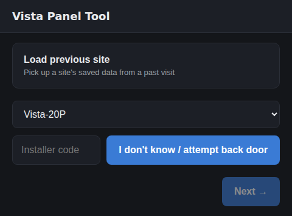
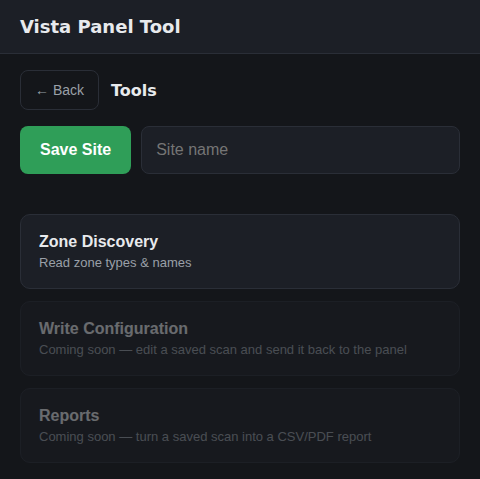
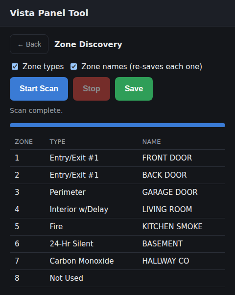
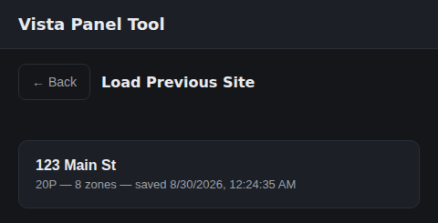

# Vista Panel Tool

A field-technician tool for Honeywell/Ademco Vista-20P alarm panels:
zone discovery today (read zone types and names via the panel's own `*56`
and `*82` installer menus), with panel config read/write intended as later
scope (deliberately deferred — see "Next steps" below). Designed to run on
a handheld: a Raspberry Pi driving a touchscreen web UI, paired with an
RP2040 coprocessor that clips directly onto the panel's keypad bus — no
Envisalink module required in the field.

See `CONCEPT.md` (project doc) for the full product concept, roadmap, and
decision history; `HARDWARE_ARCHITECTURE.md` (also saved to the project)
for the handheld BOM and wiring plan; and `firmware/SERIAL_PROTOCOL.md`
for the Pi<->RP2040 contract. `VISTA_ZONE_DISCOVERY_PROTOCOL_NOTES.md`
(project doc) is the source-of-truth for the panel protocol itself — this
repo is that document turned into runnable, transport-agnostic code.

## Status

- `vista_tool/zone_discovery.py` — the *56/*82 walk and parsing logic,
  ported from `envisalink_new`'s Home Assistant integration, transport-
  agnostic, safety rules intact. **Fully implemented and tested** (see
  `tests/`, including regression tests for the two real-hardware bugs the
  original implementation hit).
- `vista_tool/transports/tpi.py` — Envisalink TPI transport. Usable *today*
  against real hardware if you have an EVL3/EVL4 already installed — this
  is the fastest way to validate the walk logic before the handheld exists.
- `vista_tool/transports/rp2040_serial.py` — talks to the future RP2040
  coprocessor per `firmware/SERIAL_PROTOCOL.md`. **Not yet tested against
  real hardware** — the RP2040 firmware itself (bus bit-banging, adapted
  from `Dilbert66/esphome-vistaECP`'s ECP library) still needs to be built;
  this file is ready for it.
- `vista_tool/app.py` + `vista_tool/static/index.html` — minimal FastAPI
  backend and touchscreen-sized single-page UI. Runs a scan over a
  WebSocket with live per-zone progress.

## UI Features

Screenshots of the current web UI (touchscreen-sized single-page app, dark
theme). Captured from `vista_tool/static/index.html` running against a
scripted fake panel, since real Vista hardware isn't required to exercise
the UI itself.

> **Keep these current:** whenever a push changes the UI, re-capture these
> screenshots and update this section in the same push. See
> `docs/screenshots/README.md` for how.

**Home** — panel model, installer code, and a backdoor-code button up
front; `Next` unlocks once a code is entered.



**Tools** — the app's menu: Zone Discovery today, Write Configuration and
Reports as visible-but-not-yet-built placeholders, plus Save Site.



**Zone Discovery** — live per-zone progress during a scan, with Save
exporting the results table as a CSV report.



**Load Previous Site** — reload a previously saved site's data without
re-scanning or re-entering an installer code.



## Running the UI against a real Envisalink today

```
pip install -r requirements.txt
export VISTA_TRANSPORT=tpi
export VISTA_EVL_HOST=192.168.1.100   # your EVL's IP
export VISTA_EVL_PASSWORD=...
uvicorn vista_tool.app:app --host 0.0.0.0 --port 8000
```

Then open the UI, enter the installer code, and start a scan. **Read the
safety notes in the protocol doc before running against a real panel** —
in particular, `*82` (zone names) has no read-only mode; every "read" is a
real re-save of the existing descriptor (harmless as long as the walk never
touches the character-entry keys mid-field, which it doesn't, but worth
understanding before running it).

## Running tests

```
python3 -m pytest tests/ -v
```

## Next steps

Priority order (per `CONCEPT.md`): get the hardware built and ECP *reading*
solid before anything else. Write-mode is an explicitly deferred add-on,
not near-term work.

1. Build/flash the RP2040 firmware (port esphome-vistaECP's ECP class out
   of ESPHome, per its own README's note that the library works standalone;
   implement the line protocol in `firmware/SERIAL_PROTOCOL.md`). RP2040
   GPIO pin mapping isn't determined yet — will be worked out pin-by-pin
   once hardware is physically in hand.
2. Validate `RP2040SerialTransport` end-to-end against a real panel with a
   bench prototype before committing to the handheld enclosure/battery build.
3. **Write-mode is deferred** until the above is confirmed working — treat
   it as an add-on feature, not next-up work. Needs real keystroke-sequence
   protocol knowledge to be documented first (see `CONCEPT.md`).
